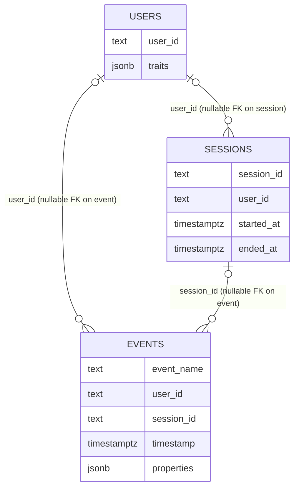

# Portable SignalQL analytics data model

Adapters map warehouse-specific schemas to this **minimal logical model**. Field names below are defaults; adapters may rename columns when compiling queries.

`user_id` and `session_id` links are nullable in the portable model, so event/session rows may exist without a matching parent row.

## Tables

### `events`

| Column       | Type        | Null | Semantics                                      |
| ------------ | ----------- | ---- | ---------------------------------------------- |
| `event_name` | `text`      | no   | Canonical event identifier                     |
| `user_id`    | `text`      | yes  | Stable user key when known                     |
| `session_id` | `text`      | yes  | Session bucket                               |
| `timestamp`  | `timestamptz` | no | Event time in UTC                              |
| `properties` | `jsonb`     | yes  | Arbitrary payload; access rules below          |

### `users`

| Column     | Type   | Null | Semantics          |
| ---------- | ------ | ---- | ------------------ |
| `user_id`  | `text` | no   | Primary key        |
| `traits`   | `jsonb`| yes  | Profile attributes |

### `sessions`

| Column       | Type          | Null | Semantics                    |
| ------------ | ------------- | ---- | ---------------------------- |
| `session_id` | `text`        | no   | Primary key                  |
| `user_id`    | `text`        | yes  | Owner                        |
| `started_at` | `timestamptz` | no   | Session start                |
| `ended_at`   | `timestamptz` | yes  | Optional explicit end        |

## JSON property access

- Dot paths refer to `properties` on events or `traits` on users, e.g. `properties.plan = 'pro'`.
- Missing keys compare false for equality filters; adapters document JSON coercion.
- Only literal comparisons are required in v0.1; nested objects use documented paths.

## Mapping custom schemas

Adapters provide **column maps** and optional **expression maps** for derived fields. Required capabilities:

- Resolve `event_name`, `timestamp`, and `user_id` (or anonymous surrogate).
- Expose `properties` as JSON or map to a flat view.

## Required vs optional

- **Required:** `events.event_name`, `events.timestamp`; one of user linkage or anonymous handling.
- **Optional:** `session_id`, `properties`, full `users` / `sessions` tables when not used.

The sample seed dataset in this repository matches this model for tests and demos.
