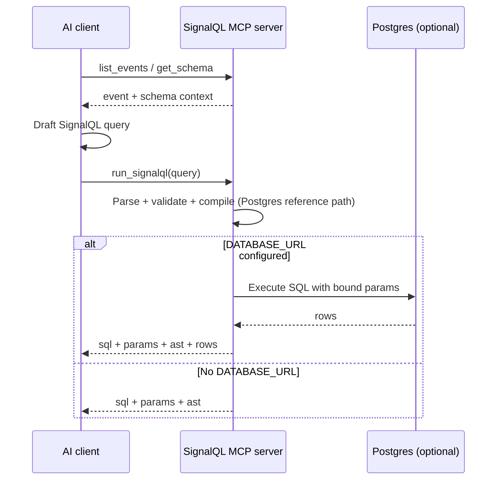

# SignalQL MCP server

The `@signalql/mcp` package exposes SignalQL over MCP **stdio** for Cursor, Claude Desktop, and compatible hosts.

## Tools

| Tool | Purpose |
| ---- | ------- |
| `run_signalql` | Validate + compile; optionally execute when `DATABASE_URL` is set |
| `get_schema` | Portable model metadata for prompts |
| `list_events` | Known event names for your demo/schema bundle |
| `describe_event` | Short description + sample properties |



## Run from npm

```bash
npx @signalql/mcp
```

## Run from a local checkout

```bash
npm install
npm run build
npm exec -w @signalql/mcp -- signalql-mcp
```

Equivalent local command: `node packages/mcp/dist/server.js`.

Configure your MCP client to launch one of those commands. Logs go to **stderr**; **stdout** carries MCP frames only.

## Safety

`run_signalql` uses `@signalql/sdk` compile path—parameterized SQL only. Execution uses bound parameters via `postgres`.

## Run this query now

```signalql
COUNT events FROM events WHERE event_name = "signup" DURING LAST 7 DAYS
```

Expected output shape: `sql` plus `params` from `run_signalql`; literal filters should be present as bound params.

Validation check: verify `params` is non-empty and SQL text contains placeholders instead of inline literal values.
