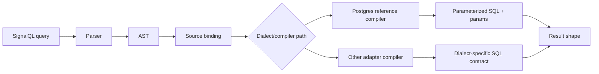

# SignalQL v0.1 specification

Readable product-facing specification for authors and implementers. Grammar is normative for parsers; semantics describe execution and outputs.

## Core concepts

- **Events:** timestamped occurrences with a name and optional JSON properties.
- **Users:** actors identified by `user_id` with optional trait JSON.
- **Sessions:** optional grouping of events in time for funnel ordering.
- **Properties:** JSON payloads on events (`properties`) or users (`traits`).
- **Time ranges:** windows restricting analysis, e.g. last N complete days.

## Grammar (EBNF)

```ebnf
query            ::= aggregate_query | funnel_query
aggregate_query  ::= aggregate_clause source_clause filter_clause time_clause group_clause?
funnel_query     ::= "FUNNEL" funnel_step ( "THEN" funnel_step )+ source_clause time_clause
aggregate_clause ::= "COUNT" distinct_opt aggregate_target
distinct_opt    ::= "DISTINCT" | ε
aggregate_target ::= "EVENTS" | "USERS"
source_clause   ::= "FROM" identifier
filter_clause   ::= "WHERE" predicate_list
predicate_list  ::= predicate ( "AND" predicate )*
predicate       ::= field_path "=" string_literal
field_path      ::= identifier ( "." identifier )*
time_clause     ::= "DURING" time_window
time_window     ::= "LAST" integer "DAYS"
                  | "BETWEEN" timestamp_literal "AND" timestamp_literal
group_clause    ::= "GROUP" "BY" group_dim
group_dim       ::= "DAY"
funnel_step     ::= string_literal
string_literal  ::= '"' { character } '"'
identifier      ::= [a-zA-Z_] [a-zA-Z0-9_]*
integer         ::= [0-9]+
```

Whitespace is insignificant outside string literals. Keywords are case-insensitive in this reference implementation.

Reference parser notes for v0.1:
- Aggregate queries require both `WHERE` and `DURING`.
- Funnel queries require at least two steps plus `FROM` and `DURING`.
- `BETWEEN` is grammar-valid; funnel compilation with `BETWEEN` is deferred in the Postgres reference compiler.

## Execution model

1. **Parse** the query into an AST; reject unknown constructs.
2. **Bind** identifiers to the portable model (`events` default source).
3. **Compile** using dialect-specific adapter behavior.
   - The Postgres reference compiler emits **parameterized SQL** and never interpolates user string literals into SQL text.
   - Other adapters must explicitly document whether they use placeholders + params, escaped literal SQL, or host-side binding requirements.
4. **Enforce limits:** max date span (default 366 days), max funnel steps (default 6), max result rows for grouped queries (adapter-defined).



## Result shapes

| Query shape              | Result columns (logical)                     |
| ------------------------ | --------------------------------------------- |
| `COUNT EVENTS`           | single row: `count`                           |
| `COUNT USERS DISTINCT`   | single row: `count`                         |
| `... GROUP BY DAY`       | `day`, `count`                              |
| `FUNNEL ...`             | `step`, `users` or `conversion_rate`        |

Exact column names may vary by dialect; adapters document mappings.

## Examples

**Event counts**

```signalql
COUNT EVENTS FROM events WHERE event_name = "signup" DURING LAST 30 DAYS
```

**Daily series**

```signalql
COUNT EVENTS FROM events WHERE event_name = "view_item" DURING LAST 14 DAYS GROUP BY DAY
```

**Two-step funnel**

```signalql
FUNNEL "signup" THEN "activated" FROM events DURING LAST 7 DAYS
```

**Segmentation**

```signalql
COUNT USERS FROM events WHERE properties.plan = "pro" AND event_name = "purchase" DURING LAST 28 DAYS
```

## Determinism

For identical inputs and compiler version, generated SQL text and parameter ordering are stable. Adapters must not introduce nondeterministic ordering without documenting it.

## Normative references

- Portable data model: [Data model](../guide/data-model.md)
- Reference compiler package: `@signalql/compiler`
